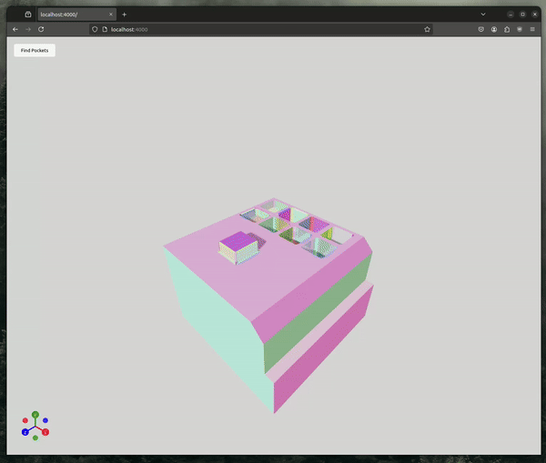

# Hadrian Pocket Detection

A simple project that identifies “pocket” features in a 3D mesh by grouping faces connected via _concave_ edges. It then visualizes these pockets in a React/TypeScript application with a 3D viewer.

---

## Goal

1. **Parse Data**  
   - Load all JSON metadata and link each face (color in `.glb`) to its `entityId`.  
2. **Detect Pockets**  
   - Identify sets of faces connected exclusively by _concave_ edges.  
3. **Visualize**  
   - Render each pocket cluster distinctly in the 3D viewer for quick and easy evaluation.

---

## Demo



## How To Run It

1. **Clone the repo**  
   ```bash
   git clone https://github.com/CristianSotomayorGit/hadrian-pocket-detection.git
2. **Submit you credentials**  
   ```bash
   Username for 'https://github.com': <YOUR USERNAME>
   Password for 'https://<YOUR USERNAME>@github.com': <YOUR TOKEN>
3. **Move into app directory**  
   ```bash
   cd hadrian-pocket-detection/app
4. **Install dependencies**  
   ```bash
   npm install
5. **Build project**  
   ```bash
   npm run build
6. **Build project**  
   ```bash
   npm run start